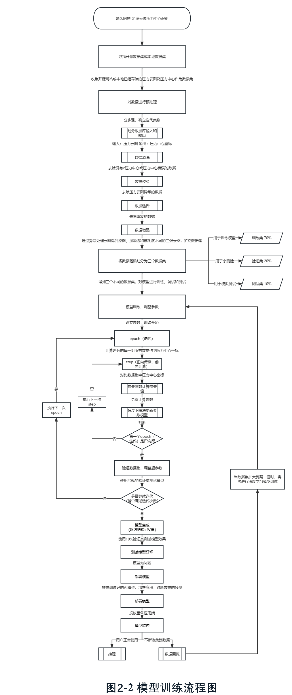
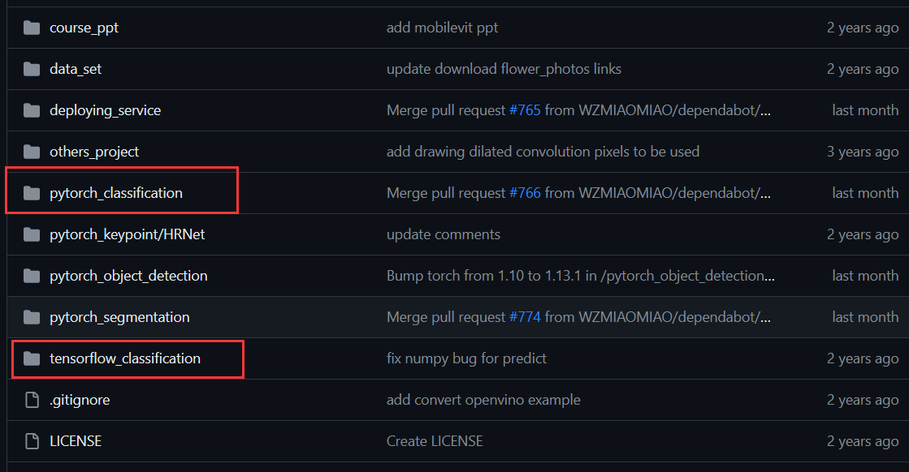

# 深度学习

## 学习路线大纲

一、python基础

1. 软件准备

2. 文件使用

3. python基础复习

4. 了解其他线上网站

二、什么是机械/深度学习？

三、数据处理

1. 数据处理的作用

2. 三大基础组件

四、了解/复刻机器学习案例

1. 机器学习的种类

2. 机器学习流程

五、了解/复刻深度学习案例

1. 深度学习的框架与网络

3. 通过复刻代码熟悉流程

六、撰写简单机器学习代码

1. 简单机器学习代码撰写

七、深度学习调参优化

1. 什么是调参，调参有什么作用？

2. 通过拉取代码或比赛进行联系

    - 百度、华为baseline修改
    - 自行寻找案例进行修改

八、如何导出模型/撰写推理代码

1. 为什么要导出模型？导出模型的作用

2. 通过案例理解各模型文件导出原理

3. 模型导出推理代码撰写，实现推理

4. 函数封装与部署

选修：如何使用线上环境进行开发？

1. 了解平台内容

2. 掌握平台用法
    - 华为modelarts
    - 智启
    - 飞桨
    - 谷歌
    - 等等

## 一、python基础

> 由于python语言相较于其他语言如c、java等语言差距较大，所以首先针对于python的基础操作作为第一课程

注：
进行过python学习编程的同学可以跳过本节

### 1.软件准备

在python开发中，通常使用pycharm作为编译器，通过ancoconda软件进行环境配置，在编译时可以使用.py文件或者.ipynb（jupyter）两种格式进行编译。

首先先进行两个软件的下载，每个下载都提供一视频一文档，自由选择：

pycharm下载与使用
 

直接上链接即可：

    参考视频： https://www.bilibili.com/video/BV1CE411Z7qg/?spm_id_from=333.337.search-card.all.click&vd_source=a4099ed25e84174f682a90592f2649c8

 

    参考文档：https://blog.csdn.net/weixin_46211269/article/details/119934323?

注：这类其实很简单，推荐看文档即可

anaconda下载与使用
 

    参考视频：【Anaconda安装与使用教程】 https://www.bilibili.com/video/BV1ze4y127wN/?p=2&share_source=copy_web&vd_source=ab41fa5e5d502dca7046f627fa0b5681

 

    参考文档：https://blog.csdn.net/u012060033/article/details/130655805?

注：
anaconda并不是开发必备的软件，只是作为一个管理工具，对环境等有更方便的配置。
但同时，如果anaconda设置出问题的话，可能导致环境上出现大的问题。因此，最低来讲，能够使用pycharm进行环境配置等做即可

other：如何再python中安装ChatGPT插件
 

    参考视频：【【Python插件】在PyCharm中安装 ChatGPT 插件】 https://www.bilibili.com/video/BV16u411V7KY/?share_source=copy_web&vd_source=ab41fa5e5d502dca7046f627fa0b5681

注：
GPT好用，但是不要贪多哦，技术学到身上是自己的

### 2.文件使用

> 这类其实是python中的一些盲区，编译文件主要有两大类：.py文件和.ipynb文件，对应的分别是正常的python和jupyter格式。

.ipynb文件
 

这个还是比较常见的，.ipynb是Jupyter Notebook文件的扩展名，它代表"**IPython Notebook**"。

优点：可以通过添加多个代码块，是代码可以分布运行，并能快捷的展示结果，使操作流程更加便捷

### 3.python基础复习
了解基础的python操作。如果python基础还不错得同学可以跳过这一步骤

https://blog.csdn.net/wufengfeng130/article/details/125363292?ops_request_misc=&request_id=&biz_id=102&utm_term=python%E5%9F%BA%E7%A1%80%E5%A4%8D%E4%B9%A0&utm_medium=distribute.pc_search_result.none-task-blog-2~all~sobaiduweb~default-4-125363292.142^v99^pc_search_result_base9&spm=1018.2226.3001.4187

### 4.了解其他线上网站

华为下的：modelarts平台
百度下的：easydl平台
其他平台如谷歌提供的线上环境等
    
这写平台都可以作为我们得开发的环境如pycharm，区别为本地我们的环境可以自行配置包等，线上环境一般都是集成的好环境

## 二、什么是机械/深度学习？

参考学习连接：完成第一课程p1内容：https://www.bilibili.com/video/BV1nt411r7tj?p=5&vd_source=a4099ed25e84174f682a90592f2649c8

工作室寒假培训第一课程

要求完成学习后可以结合实例手绘出一份深度学习流程

类似于：

## 三、数据处理

### 1.数据处理的作用

一文了解数据处理的作用：https://blog.csdn.net/DeepAIedu/article/details/123505096?ops_request_misc=&request_id=&biz_id=102&utm_term=%E6%95%B0%E6%8D%AE%E5%A4%84%E7%90%86%E5%9C%A8%E6%B7%B1%E5%BA%A6%E5%AD%A6%E4%B9%A0%E4%B8%AD%E7%9A%84%E4%BD%9C%E7%94%A8&utm_medium=distribute.pc_search_result.none-task-blog-2~all~sobaiduweb~default-1-123505096.nonecase&spm=1018.2226.3001.4187

### 2.三大基础组件

学习数据处理应用的三大基础组件，数据组件：numpy、pandas，绘图组件：matlab
【【python教程】数据分析——numpy、pandas、matplotlib】 https://www.bilibili.com/video/BV1hx411d7jb/?share_source=copy_web&vd_source=ab41fa5e5d502dca7046f627fa0b5681

补充知识：数据归一化，降维，主成分分析等p6-p18：https://www.bilibili.com/video/BV1nt411r7tj?p=5&vd_source=a4099ed25e84174f682a90592f2649c8

## 四、了解/复刻机器学习案例

### 1.机器学习的种类

一文了解机器学习基础知识：https://blog.csdn.net/pengxiang1998/article/details/124288232?ops_request_misc=&request_id=&biz_id=102&utm_term=%E6%9C%BA%E5%99%A8%E5%AD%A6%E4%B9%A0%E7%A7%8D%E7%B1%BB&utm_medium=distribute.pc_search_result.none-task-blog-2~all~sobaiduweb~default-7-124288232.142^v99^pc_search_result_base9&spm=1018.2226.3001.4187

### 2.机器学习流程

学习课程p2-p5：https://www.bilibili.com/video/BV1nt411r7tj?p=5&vd_source=a4099ed25e84174f682a90592f2649c8

## 五、了解/复刻深度学习案例

### 1.深度学习的框架与网络

结合实践：劈里啪啦wz前两课1.1-1.2：https://www.bilibili.com/video/BV1b7411T7DA/?spm_id_from=333.999.0.0&vd_source=a4099ed25e84174f682a90592f2649c8

全面理论知识学习参考：https://space.bilibili.com/1567748478/channel/seriesdetail?sid=358497（推荐后面再看）

### 2.环境配置，通过复刻代码熟悉流程

结合实践：劈里啪啦wz前两课1.1-1.2：https://www.bilibili.com/video/BV1b7411T7DA/?spm_id_from=333.999.0.0&vd_source=a4099ed25e84174f682a90592f2649c8所提供的代码进行环境配置与复刻

代码仓库：https://github.com/WZMIAOMIAO/deep-learning-for-image-processing

## 六、撰写简单机器学习代码

### 1.简单机器学习代码撰写

- 通过自己所学的知识进行简单机器学习代码撰写，基于百度飞机英雄联盟大师预测进行修改：https://aistudio.baidu.com/projectdetail/3899542

## 七、深度学习调参优化

### 什么是调参，调参有什么作用？

机器学习：模型调参
在机器学习中，模型的性能往往受到许多因素的影响，例如模型的超参数、数据的质量、特征选择等。其中，模型的超参数调节是模型优化中最重要的环节之一，因为正确的调参可以使模型的效果最大化。

什么是超参数？
超参数（Hyperparameters）是机器学习算法中需要人为设定的参数，它们不能直接从训练数据中学习得出。与之对应的是模型参数（Model Parameters），它们是模型内部学习得来的参数。

以支持向量机（SVM）为例，其中 C、kernel 和 gamma 就是超参数，而学习到的权重 w 和偏置 b 是模型参数。

经验调参
开始时使用默认参数：首先，可以使用算法的默认参数进行训练，以获得模型的初始表现。

调整数据预处理和特征选择方法：在进行模型选择之前，可以尝试不同的数据预处理和特征选择技术，以提高模型的准确性和泛化能力。

逐步调整超参数：建议先调整较重要的参数，例如学习率、迭代次数等，然后再尝试其他参数。同时，建议进行逐步的超参数调整，而非大幅度更改。

交叉验证：使用 K 折交叉验证来评估不同超参数组合下的模型性能，并选择最优的参数组合。

验证集：将训练集分为训练集和验证集，然后在验证集上评估模型效果，并使用其来微调超参数。在选择最终的超参数时，可以使用验证集来确认模型的泛化能力。

经验法则：可以根据经验法则对超参数进行调整。例如，学习率通常应为 0.01 或更小，批量大小可以设置为 32 或 64，等等。

超参数搜索
在机器学习的实际应用中，我们往往需要选择合适的超参数才能得到一个好的模型。搜索超参数的方法有很多种，本文介绍其中主流的两种：网格搜索(Grid Search)和随机搜索(Random Search)。

网格搜索
网格搜索是一种最常见、最简单的参数选择方法。它将每个超参数的值域分成若干份，对每个超参数的取值都进行一次穷举搜索，获得不同参数组合的模型效果，最后找到最优超参数组合。

以下是 scikit-learn 中 GridSearchCV 的示意图：

GridSearchCV 会对每个超参数进行交叉验证，返回一个结果网格，其中的每个元素都表示一个超参数组合和对应的模型评分。可以根据评分挑选最优的超参数组合。

随机搜索
随机搜索与网格搜索类似，都是通过搜索超参数空间来寻找最优的超参数组合。不过它在超参数搜索的空间上采用均匀分布或高斯分布等概率分布进行随机采样。这比网格搜索更加灵活，因为我们可以自己决定搜索空间的分布形式，也可以优化搜索空间的采样密度。

与 GridSearchCV 不同，RandomizedSearchCV 不需要对每一种可能的值进行尝试，而只需要对指定的参数空间中的几个点进行检查即可获得更好的结果。当搜索空间较大且难以确定最佳值时，随机搜索是一种非常有效的方法。

其他调参搜索算法
1-贝叶斯优化：贝叶斯优化是一个优雅而强大的超参数搜索算法，它可以根据历史结果更新模型，并选择新的超参数进行评估。与传统的网格搜索和随机搜索相比，贝叶斯优化可以通过高效地利用历史信息来加速超参数搜索。

2-梯度优化：梯度优化是基于梯度下降的优化方法，它可以在搜索空间中沿着梯度方向来搜索最优超参数。相比于传统的网格搜索和随机搜索，梯度优化可以更快地搜索到最优解。

3-进化算法：进化算法是一种模拟自然进化过程的优化方法，它将搜索空间中的超参数看做个体，并通过自然选择、交叉和突变等操作来生成新的超参数集合。相比于传统的搜索方法，进化算法可以更全面地搜索超参数空间，而且收敛速度较快。

4-强化学习：强化学习是一种通过试错来学习最优策略的方法，它可以应用于超参数搜索领域。通过模拟不同超参数组合在模型上的表现，强化学习可以找到最优的超参数组合。

调参技巧
1-观察学习曲线和验证曲线：通过观察模型的学习曲线和验证曲线，可以判断模型是否存在欠拟合或过拟合的问题。如果模型存在欠拟合，则需要增加模型复杂度或特征数量；如果模型存在过拟合，则需要减小模型复杂度或采用正则化方法。

2-交叉验证：交叉验证可以避免模型的泛化误差。通常采用 K 折交叉验证来选择最优的超参数组合，其中 K 是指将训练数据分成 K 份，每次使用其中一份作为验证集，剩余部分作为训练集。

3-网格搜索和随机搜索：网格搜索和随机搜索是两种常用的超参数搜索方法。网格搜索适用于超参数空间比较小且已知的情况，而随机搜索适用于超参数空间比较大且不确定的情况。

4-细化搜索范围：当发现某些超参数对模型性能的影响较大时，可以将搜索范围细化以获得更好的效果。

5-停下来的时机：当模型性能不再提升时，应该停止调参。此时继续调参只会浪费时间和资源，并可能导致过拟合。

6-其他技巧：还有一些调参的技巧，比如使用正则化方法（如 L1 正则化和 L2 正则化）、使用集成学习方法（如随机森林和梯度提升树）等。

调参注意事项
超参数调整需要注意以下几点：

选择合适的搜索算法：搜索算法对超参数搜索有着重要的影响。网格搜索和随机搜索是目前应用最广泛的两种方法，它们各有优缺点，可以根据情况选择。
搜索尽可能多的超参数：我们无法预先知道哪些超参数会影响模型性能，因此建议搜索尽可能多的超参数，以便找到最优解。
均衡时间和性能：超参数搜索需要花费大量时间和计算资源，需要在效果和速度之间做出好的平衡。
多次搜索取平均：由于超参数搜索本质上是一种随机过程，同一组超参数可能会得出不同的结果。因此，建议进行多次搜索并取平均结果。

### 通过拉取代码或比赛进行联系

#### 一、百度、华为baseline修改

参考链接：

https://aistudio.baidu.com/personalcenter/thirdview/490063

https://aistudio.baidu.com/competition/2/1

#### 二、自行寻找案例进行修改

## 八、如何导出模型/撰写推理代码

### 1.为什么要导出模型？导出模型的作用

通过案例理解各模型文件导出原理

跳转至仓库学习链接：https://github.com/doublelf/Atlas-200I-DK-A2/blob/main/doc/Three/explain.md

### 2.函数封装与部署

https://blog.csdn.net/qq_39967751/article/details/124888762?ops_request_misc=%257B%2522request%255Fid%2522%253A%2522170667890516800197043626%2522%252C%2522scm%2522%253A%252220140713.130102334..%2522%257D&request_id=170667890516800197043626&biz_id=0&utm_medium=distribute.pc_search_result.none-task-blog-2~all~top_click~default-2-124888762-null-null.142^v99^pc_search_result_base9&utm_term=%E6%A8%A1%E5%9E%8B%E9%83%A8%E7%BD%B2&spm=1018.2226.3001.4187

## 选修：如何使用线上环境进行开发？

### 了解平台内容

### 掌握平台用法

- 华为modelarts
- 智启
- 飞桨
- 谷歌
- 等等 

